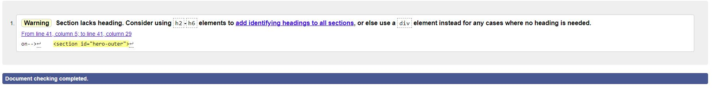
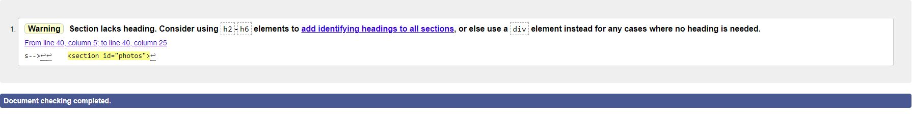
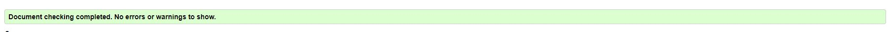
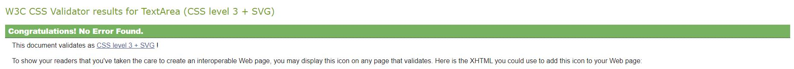
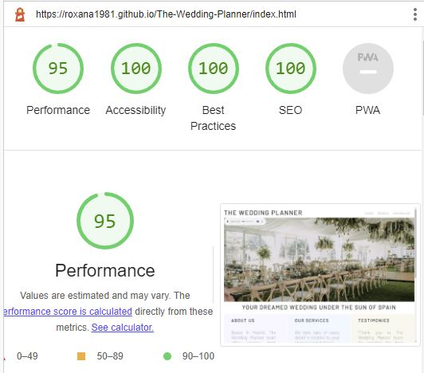
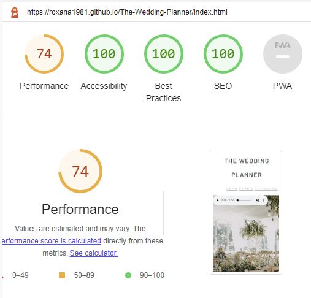

# The Wedding Planner
**The Wedding Planner** website offers couples from around the world a service of event planning and assistance for creating the perfect wedding in Spain.

The purpose of [this site](https://roxana1981.github.io/The-Wedding-Planner/index.html) is to provide end users with information about **The Wedding Planner** team, services offered, pictures of previous events, testimonies from customers and a contact section to engage with potential customers.

## Project Background
The website was created for completion of the first Milestone Project for the Software Development and E-commerce Applications diploma.  It was built using the knowledge gained from HTML and CSS modules of the course.

## User experience design 

The target audience for this website are users who wish to have their wedding in Spain and need assistance in planning, organizing, and executing the event. 

The key objective of the website is to provide a user friendly experience, through a smooth navigation and access to information.  

Being a commercial website, the aim is to attract potential customers and let them engage easily with the business. 

## Website design 
**The Wedding Planner** is a website thought to be easy to navigate and visually appealing.  

-**Structure**: It consists of 3 pages (Homepage, gallery, and a “Contact Us” page), with a navigational bar and footer to access social media channels in separate tabs.

-**Colours and background**: Colours of the page are mainly white, light grey and pastel shades, which compliment well with the hero/main image of the site as well as with the gallery photos and image used as background of the “Contact Us” page.  Colours and background of the site are taught to be of a relaxing shade and elegant.

-**Typography**: Font Barlow imported from Google Fonts. 

## Website features 

### Homepage

**Navigation bar**

The navigation bar consists of the name of the company at the top left and links to the "Gallery" and “Contact Us” pages.  
End users can go back to the homepage through the company logo or through the homepage link.

**Main image**

The main image in the homepage has embedded an audio control bar at the top left.

**Main section**

The main section of the homepage contains the slogan of the brand "Your dream wedding under the sun of Spain" and three key sections which contain "About us", "Services" and "Testimonies" about the company.

**Footer**

The footer reflects the icons for end users to visit the brand's Facebook, Instagram and Youtube accounts.  Each of them opening in new browser windows.  Social media links in the footer can be accessed in each of the website pages.

### Gallery

This page reflects a collection of photos from differents events.  Photos have been carefully chosen in order to mantain a similar esthetic of the main image in the homepage.  End users can access to the "Gallery" through the navigation bar.

### Contact Us

This page of the website contains a contact form for the company to engage with end users.  The contact form includes the following sections: first name, last name, telephone, email, wedding date, message and a submit button.  
The photo used as background of this page and colours of the contact form follow the style and esthetic of the website. 

## Future developments

The following features are considered for future developments, in order to improve the website and enhance user experience:

1.  Add slide feature to the Gallery page.
2.  Add a blog page with information about Spain, popular wedding venues in the country and wedding trends.
3.  Add additional page to the website with videos of past events.
4.  Add an FAQ page.

## Testing

**Functional**

-  Navigation bar was tested to ensure that Home, Gallery and Contact Us links work for users to access every page of the website.  Homepage can also be accessed through a click to **The Wedding Planner** logo. 
-  Sound bar available in the main image of the homepage tested.
-  Social media links in the footer were tested in the three pages of the website to ensure that they correctly open in a new browser window.

**Responsive user experience**

-  Tested the responsive design with break points of: 1200px, 1024px, 740px and 320px using Chrome dev tool.

-  Testing was completed on the following devices: desktop, laptop, Ipad Mini and Samsung A51.

-  Home page required various styling adjustments of navigation bar, main image and main content for the above break points.  

-  Gallery page of the website has the best responsive design in all devices.

-  Contact Us page required a level of adjustments for some of the break points to ensure correct ratio of the contact form and background image on screens.

Although updates were performed after testing of the responsive design, there are still additional changes possible in order to improve the overall user experience.

**Bugs**

*Fixed:*

-  Througout the responsive design development and testing, there were a number of bugs identified which were subsequently resolved through adjustment in CSS styling.

*Unfixed:*

-  It was identified that in Ipad Mini, the audio control in the main image does not allow the user to unmute.  Therefore, the music can not be listed to.

-  At certain resolutions, the navigation bar links may move on the top of each other incorrectly.

**Code validator testing**

HTML and CSS code were validated through W3C, Jigsaw and Lighthouse validators tools, with the following results:

*W3C*

-  Index file:

-  Gallery:

-  Contact Us:

*Jigsaw*

-  CSS file:

*Lighthouse (Dev Tools)*

-  For desktop:

-  For mobilephone:

## Deployment

The code was deployed through Github.  Steps followed for the deployment were:

1. Access repository section in Github platform.
2. Go to the project to be deployed.
3. Navigate to settings.
3. Select pages section.
4. Within "Build and Deployment" section, select the source "deploy from a branch", branch to be marked as “main” and folder as “root”. 
5. Click Save.
5. After few seconds, site was confirmed to be live at: https://roxana1981.github.io/The-Wedding-Planner/

## Credits

**Content**

Inspiration for the theme of the website came from the following businesses of wedding planning:

-[spain4weddings](https://www.spain4weddings.com/)

-[peachperfectweddings](https://peachperfectweddings.com)

-[maruanderson](https://maruanderson.com)

**Code**

The development of the website was inspired by Love Running project of the Code Institute.  
Throughout the development of the project, the below resourses were accessed to assist me with some the code:

-[Audio to a webpage tutorial](https://www.youtube.com/watch?v=d5cHhIv35HI)

-[Audio element](https://www.w3schools.com/html/html5_audio.asp)

-[CSS buttons](https://www.w3schools.com/css/css3_buttons.asp)

**Images**

All photos of the website by Gillian Harrison from Pexels:
https://www.pexels.com/@gillian-harrison-3071696/

**Audio**

-Look Both Ways by Nathan Moore sourced from Youtube studio.  No copyright music.

## Acknowledgements

I would like to thank the Code Institute for the opportunity of learning HTML and CSS languages in the first module of the Diploma, and to my mentor Harry Dhillon for the guidance and support.

