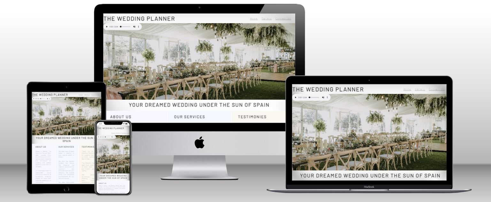
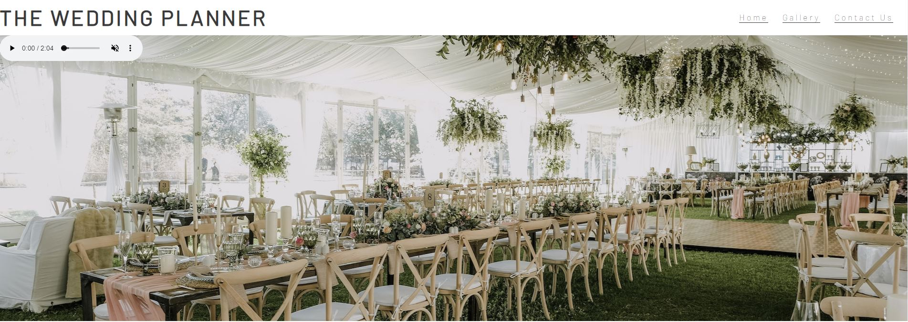
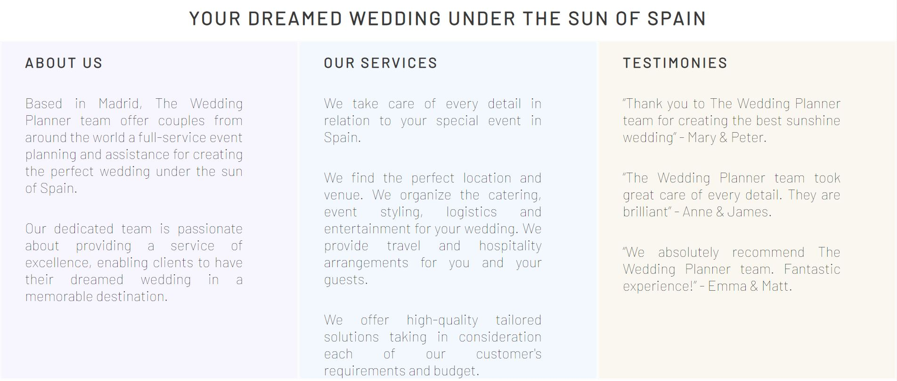
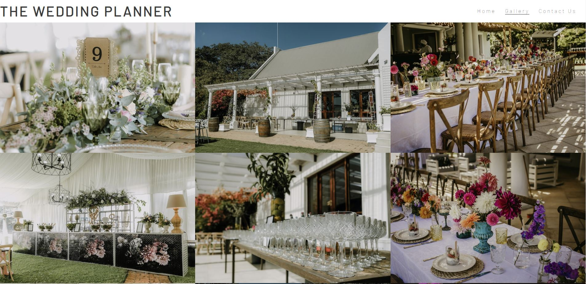
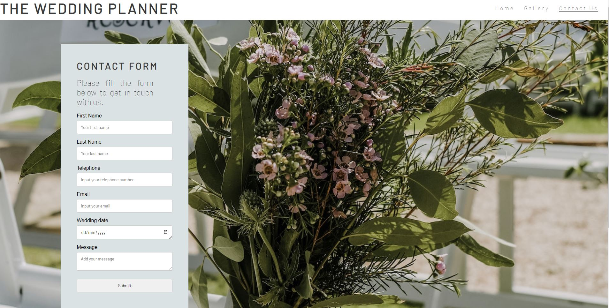

# The Wedding Planner
**The Wedding Planner** website offers couples from around the world a service of event planning and assistance for creating the perfect wedding in Spain.

The purpose of [this site](https://roxana1981.github.io/The-Wedding-Planner/index.html) is to provide end users with information about **The Wedding Planner** team, services offered, pictures of previous events, testimonies from customers and a contact section to engage with potential customers.

## Project Background
The website was created for completion of the first Milestone Project for the Software Development and E-commerce Applications diploma.  It was built using the knowledge gained from HTML and CSS modules of the course.

## User experience design 

## Website design 
**The Wedding Planner** is a website thought to be easy to navigate and visually appealing.  

-**Structure**: It consists of 3 pages (Homepage, gallery, and a “Contact Us” page), with a navigational bar and footer to access social media channels in separate tabs.

-**Colours and background**: Colours of the page are mainly white, light grey and pastel shades, which compliment well with the hero/main image of the site as well as with the gallery photos and image used as background of the “Contact Us” page.  Colours and background of the site are taught to be of a relaxing shade and elegant.

-**Typography**: Font Barlow imported from Google Fonts. 

## Website features 

### Homepage

**Navigation bar**

The navigation bar consists of the name of the company at the top left and links to the "Gallery" and “Contact Us” pages.  
End users can go back to the homepage through the company logo or through the homepage link.

**Main image**

The main image in the homepage has embedded an audio control bar at the top left.

**Main section**

The main section of the homepage contains the slogan of the brand "Your dream wedding under the sun of Spain" and three key sections which contain "About us", "Services" and "Testimonies" about the company.

**Footer**

The footer reflects the icons for end users to visit the brand's Facebook, Instagram and Youtube accounts.  Each of them opening in new browser windows.  Social media links in the footer can be accessed in each of the website pages.

### Gallery

This page reflects a collection of photos from differents events.  Photos have been carefully chosen in order to mantain a similar esthetic of the main image in the homepage.  End users can access to the "Gallery" through the navigation bar.

### Contact Us

This page of the website contains a contact form for the company to engage with end users.  The contact form includes the following sections: first name, last name, telephone, email, wedding date, message and a submit button.  
The photo used as background of this page and colours of the contact form follow the style and esthetic of the website. 

## Future developments

The following features are considered for future developments, in order to improve the website and enhance user experience:

1.  Add slide feature to the Gallery page.
2.  Add a blog page with information about Spain, popular wedding venues in the country and wedding trends.
3.  Add additional page to the website with videos of past events.
4.  Add an FAQ page.

